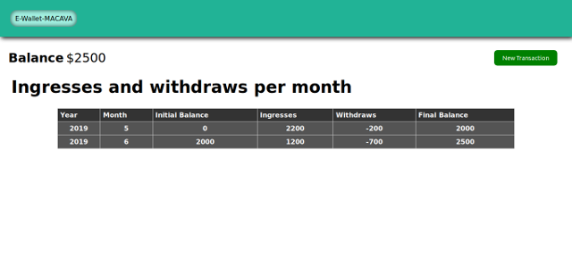

Source: [GitHub Original Poster](https://github.com/codeableorg/react-digital-wallet-macava)

Demo available at: [Netlify MaCaVa](https://sad-northcutt-a362e1.netlify.com/)

# Redux Extended Project

Create a digital wallet application using React and Redux.

## Requirements

- [x] It should be a single user application.
- [x] The user should be able to track their withdraws and ingresses.
- [x] Each withdraw and ingress should be categorized.
- [x] The user should be able to see a table with all their withdraws and ingresses categorized.
- [x] The user should be able to see what category produce the biggest amount of withdraws and ingresses.
- [x] The application should have a route to see how much money it has, how much money ingress that month and how much money were withdrawn that month.
- [x] The application should have a route to add a new withdraw or ingress.
- [ ] The application should have a route to see the categorized withdraws and ingresses per month.
- [x] At the end of each month the final amount of money should be copied to the next month, previous months should not be updatable.

## Acceptance Criteria

- [x] It must use semantic HTML
- [x] It must use React
- [ ] It must be Responsive
- [x] It must use CSS in JS
- [ ] It must have tests
- [x] It must use Reach Router
- [ ] It could use Reach UI components
- [x] It must use Redux
- [x] It must pass with green the Accessibility tests of the Chrome Audits
- [x] It must pass with green the Best Practices tests of the Chrome Audits
- [ ] It must pass with green the SEO tests of the Chrome Audits

## Team Members

- Carlos Ayala
- Marieth Pérez
- Valeria Vassallo

This project was bootstrapped with [Create React App](https://github.com/facebook/create-react-app).

## Available Scripts

In the project directory, you can run:

### `npm start` or `yarn start`

Runs the app in the development mode. 
Open [http://localhost:3000](http://localhost:3000) to view it in the browser.

The page will reload if you make edits. 
You will also see any lint errors in the console.

### `npm test` or `yarn test`

Launches the test runner in the interactive watch mode. 
See the section about [running tests](https://facebook.github.io/create-react-app/docs/running-tests) for more information.

### `npm run build` or `yarn build`

Builds the app for production to the `build` folder. 
It correctly bundles React in production mode and optimizes the build for the best performance.

The build is minified and the filenames include the hashes. 
Your app is ready to be deployed!

See the section about [deployment](https://facebook.github.io/create-react-app/docs/deployment) for more information.

### `npm run eject` or `yarn eject`

**Note: this is a one-way operation. Once you `eject`, you can’t go back!**

If you aren’t satisfied with the build tool and configuration choices, you can `eject` at any time. This command will remove the single build dependency from your project.

Instead, it will copy all the configuration files and the transitive dependencies (Webpack, Babel, ESLint, etc) right into your project so you have full control over them. All of the commands except `eject` will still work, but they will point to the copied scripts so you can tweak them. At this point you’re on your own.

You don’t have to ever use `eject`. The curated feature set is suitable for small and middle deployments, and you shouldn’t feel obligated to use this feature. However we understand that this tool wouldn’t be useful if you couldn’t customize it when you are ready for it.

## Learn More

You can learn more in the [Create React App documentation](https://facebook.github.io/create-react-app/docs/getting-started).

To learn React, check out the [React documentation](https://reactjs.org/).

### Code Splitting

This section has moved here: https://facebook.github.io/create-react-app/docs/code-splitting

### Analyzing the Bundle Size

This section has moved here: https://facebook.github.io/create-react-app/docs/analyzing-the-bundle-size

### Making a Progressive Web App

This section has moved here: https://facebook.github.io/create-react-app/docs/making-a-progressive-web-app

### Advanced Configuration

This section has moved here: https://facebook.github.io/create-react-app/docs/advanced-configuration

### Deployment

This section has moved here: https://facebook.github.io/create-react-app/docs/deployment

### `npm run build` fails to minify

This section has moved here: https://facebook.github.io/create-react-app/docs/troubleshooting#npm-run-build-fails-to-minify

### Screen captures

